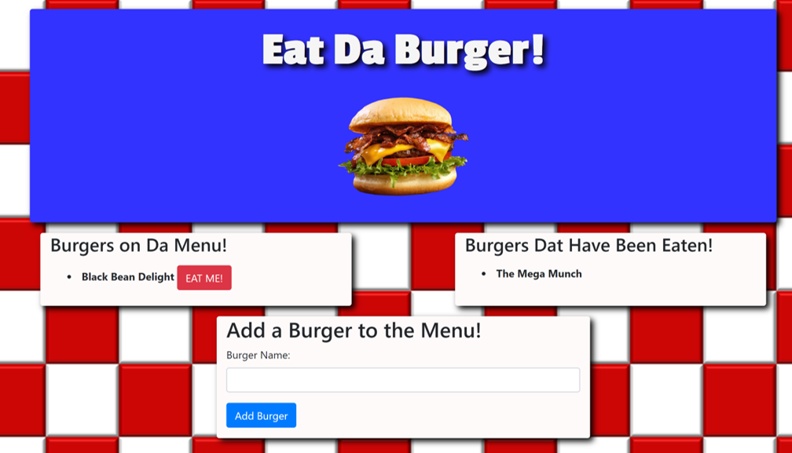

# Eat Da Burger!

David Ferro

https://burger-sequelize91.herokuapp.com/
https://git.heroku.com/burger-sequelize91.git
https://github.com/davidferro91/burger-sequelize

## Description

Welcome!  I hope you've brought a big appetite, because today we will eat da burger ... with Sequelize!

This is an app where you and your friends can add the burger of their dreams to the menu... and then eat it!  All you have to do is type in the type of burger you would like, or peruse the menu for one that already sounds tasty, then click the 'Eat Me' button!  It will move over to the list of those delicious morsels that have already been consumed.

This app was developed using MySQL and Sequelize with JAWS_DB to create a database in order to store the burgers, whether they're brand new or eaten weeks ago.  The HTML was developed via handlebars in order to render the data from the database easily.

This app also employs the Model View Controller setup of files, which splits the server processes into many different groups of files.  The model files create, read, update, or delete data from the database depending on the requests from the user, the view files handle the handlebars and the display of the HTML for the user, and the controller file handles all of the routing for the application, including the HTML pages and the API.

If you have any questions, feel free to contact me at david-ferro@sbcglobal.net.

Bon appétit!